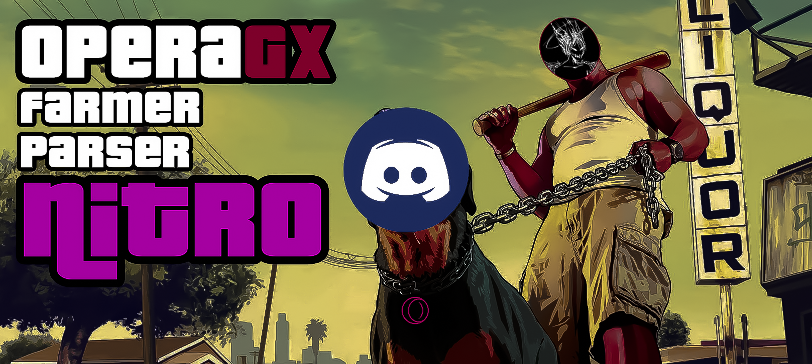

<p align="center">

  <h2 align="center">OperaGX Parser Nitro</h2>
  <p align="center">
    <br>
  </p>
  
  <table align="center">
    <tr>
    <td>
      
    </td>
    </tr>
  </table>

## Installation | Установка

```bash

# [RU] Запускаем файл !Install.bat (OperaGX_Parser_Nitro\Nitro-Parser-Farmer\Install.bat)

# [EN] Run the !Install.bat file (OperaGX_Parser_Nitro\Nitro-Parser-Farmer\Install.bat)
```

## Functions | Функции
<br>


Farmer links | Фармер ссылок

```bash
# [RU] !Start.bat - Получает и заносит ссылки в txt файл TOKENS/tokens.txt

# [EN] !Start.bat - Receives and writes links to the txt file TOKENS/tokens.txt
```
<br>
Parser | Парсер:

```bash
# [RU] !parserToSize.bat - Запускается во время фарма ссылок, что бы когда файл не набирал большой вес.
# [RU] !pars10.bat - Берёт файл tokens.txt и разбивает его на txt файлы по 10 строк, после чего перемещает в папку Pars-10
# [RU] !pars50.bat - Берёт файл tokens.txt и разбивает его на txt файлы по 50 строк, после чего перемещает в папку Pars-50

# [EN] !parserToSize.bat - Runs during link farming, so that when the file does not gain a lot of weight.
# [EN] !pars10.bat - Takes the file tokens.txt and splits it into txt files of 10 lines, and then moves it to the Pars-10 folder
# [EN] !pars50.bat - Takes the file tokens.txt and splits it into txt files of 50 lines, and then moves it to the Pars-50 folder
```
  <table align="center">
    <tr>
    <td>
      
    </td>
    </tr>
  </table>

